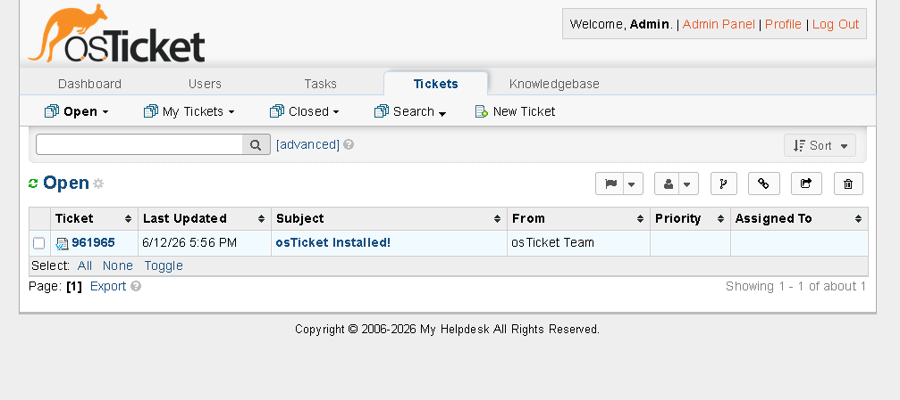

# osTicket Help Desk - Docker Deployment

## Overview
Self-hosted help desk ticketing system deployed using Docker Compose. This project demonstrates IT infrastructure deployment, ticketing system administration, and documentation skills.

## Architecture
- **osTicket** (osticket/osticket) - Help desk application
- **MariaDB 10.11** - Database backend
- **Docker Compose** - Container orchestration

## Admin Panel

